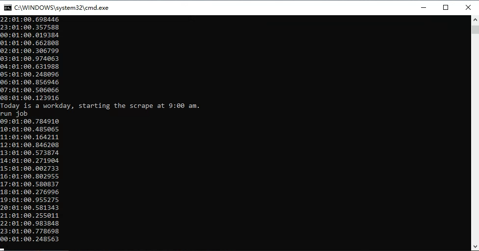
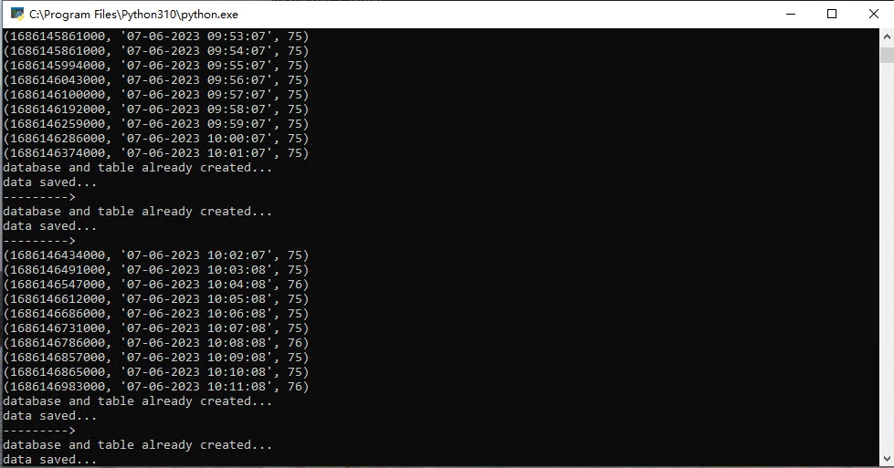

### This is a tool to scrape the CNN Fear & Greedy Index, using selenium.

 

- Intall the required package: `pip install selenium` `pip install schedule`
- `sqlite3` is a built-in database in Python, just import.
- Double click `auto_run_scrape_fear_idex.bat` to run `scrape_fear_idex.py`
- To update the driver, goto: https://chromedriver.chromium.org/downloads
- Create a `_secret.py` file to save your email user name and password to send email out.

 

#### OR, run as schedule task on the cloud server:
- `python schedule_runn.py`, this cmd will schedule a task run every weekday at 9:00 am EST
- auto_schedule_run.bat file will auto run the cmd above.

 

#### Examples:

